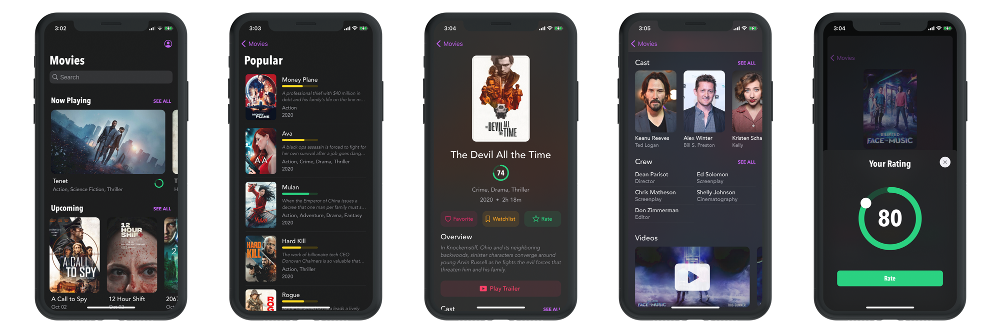
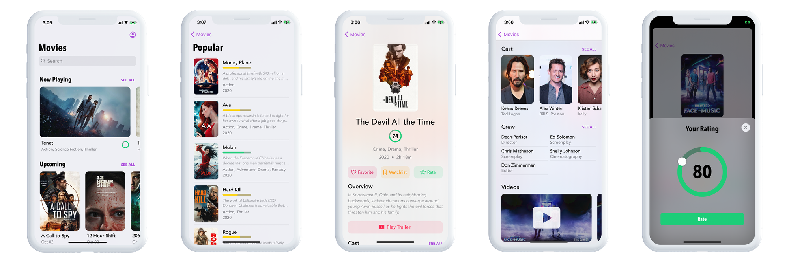

# MovieDemo
<!-- blank line -->
<figure class="video_container">
  <video loop autoplay>
    <source src="images/videodemo.mp4" type="video/mp4">
  </video>
</figure>
<!-- blank line -->

MovieDemo is a demo application built as a showcase for potential clients or employers. It's completely built with Swift and uses data from TheMovieDB API.

## Screenshots

## Features

## About Me

## Contact
- Email: <oscar.vernis@gmail.com>
- LinkedIn: [oscar-vernis](https://www.linkedin.com/in/oscar-vernis/)