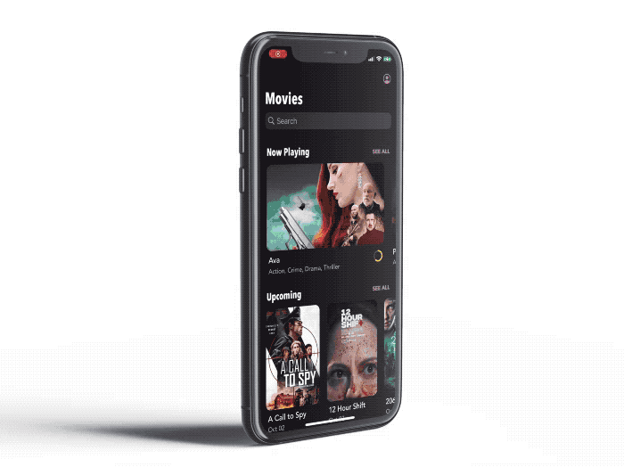

# MovieDemo

[Full Video](https://dl.dropboxusercontent.com/s/oz6onb19ov46u4f/video_screen.MP4?dl=0)

MovieDemo is a demo application built as a showcase for potential clients or employers. It's completely written in Swift and uses data from TheMovieDB REST API.

## Screenshots

## Features
- Built natively with Swift.
- Custom Interface.
- Use of MVC and MVVM and Coordinator patterns.
- Use of iOS 13 Compositional Layout for CollectionViews.
- Custom Rating control that can be used to display or set a rating.
- Generic CollectionView to show lists of Movies, Cast or Crew members, etc.
- Haptic Feedback for user actions.
- Login to your TheMovieDB account, which can be set as optional or required.
- Session management using the device Keychain to save the SessionId from the server.
- User Profile where you can see the movies you have Favorited, added to your Watchlist and added a Rating.
- Internalization in both English and Spanish.
- Use of Swift Package Manager for dependency management.

### Libraries used:
- AlamoFire
- AlamoFireImage
- ObjectMapper
- KeychainAccess
- Loaf
- Among others...

## About Me
Software developer with 10 years of experience, specialized on the iOS platform. I have experience in the development and long term maintenance of apps, including the full cycle, from conception to submission to the App Store. Self-taught, pragmatic, reliable and obsessed with the details.

## Contact
Email: <oscar.vernis@gmail.com> 
LinkedIn: [oscar-vernis](https://www.linkedin.com/in/oscar-vernis/)